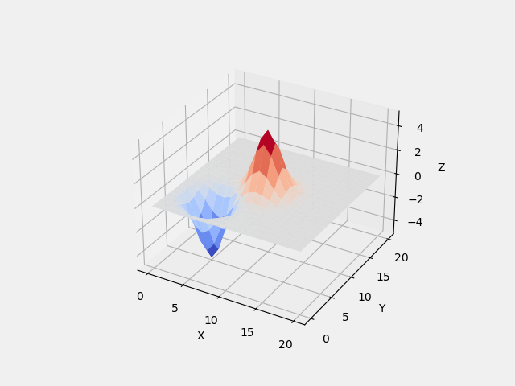
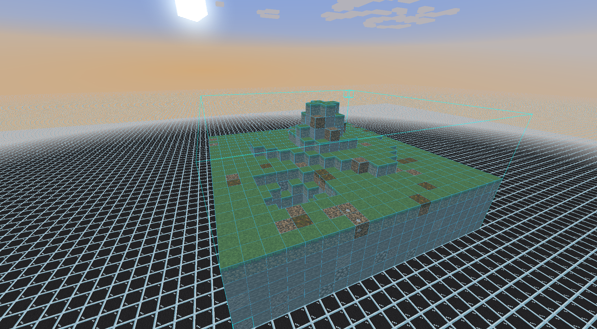
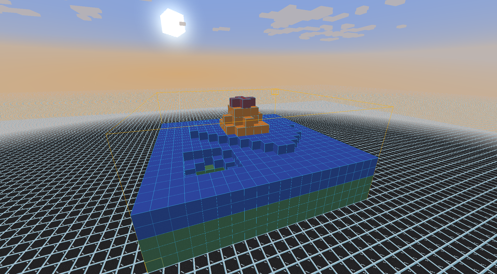

# Landforms Generator

## Index
- [Prerequisite](#Prerequisite)
- [Main Interface](#Main-Interface)
	- [Relief Settings](#Relief-Settings)
	- [Menu Bar](#Menu-Bar)
		- [File](#File)
		- [Edit](#Edit)
		- [Preferences](#Preferences)
- [Files](#Files)
	- [Project File](#Project-File)
	- [Config File](#Config-File)
		- [Layer Mode](#Layer-Mode)
		- [Landscape Mode](#Landscape-Mode)
- [Example](#Example)
---

## Prerequisite
Make sure to have run `pip install -r requirements.txt` to install requiered modules


## Main Interface
### Relief Settings
- There is 3 Offset settings : Offset X, Offset Y, Offset Z, which are the offsets of respective axes. By default, Offset X and Offset Y are in the middle of your grid. Offset Z is limite between -250 and 250
- Height : The maximal height of your new relief. Between -250 and 250.
- Q : Higher is the Q fatter is the peak. Between 1 and 50 000
- The "Visualize" button show you the plot with the actual relief without adding it to the plot, you can change it's settings
- The "Add Relief" button add the actual relief to the plot

### Menu Bar
#### File
- "New" (Ctrl+N) : Allow you to create a new grid by choosing a side size. Your X and Y axes will be set according to this size. Between 1 and 1 000.
- "Open File" (Ctrl+O) : Allow you to open a valid project (cf [Project Files](#Project-Files)) as JSON to load it.
- "Save As..." (Ctrl+Shift+S) : Allow you to save a project as JSON and as a litematic according to your config file (cf [Config File](#Config-File))

#### Edit
- "Undo" (Ctrl+Z) : Allow you to remove the last relief added
- "Redo" (Ctrl+Y) : Allow you to put back the last relief you removed with "Undo"

#### Preferences
- "Edit Litematic Settings" : Open your config.json file used for the litematic generation (cf [Config File](#Config-File))
- "Live Render" (Ctrl+L) : Automatically visualize the relief generated with current settings, instead of clicking the "Visualize" button. 
- "Help" (Ctrl+H) : Open this page


## Files
### Project File
A valid Project File looks like this :
```json
{
    "SideSize": 500,
    "Peaks": [
        {
            "OffsetX": 250,
            "OffsetY": 250,
            "OffsetZ": 0,
            "Height": 100,
            "q": 5005
        },
        {
            "OffsetX": 78,
            "OffsetY": 26,
            "OffsetZ": -21,
            "Height": -10,
            "q": 5005
        }
    ]
}
```
`"SideSize"` is the size of your X and Y axes
`"Peaks` is the list containing every peaks datas.
Using this, you can easily create reliefs without using the GUI

### Config File
You can choose which blocks will be used for the litematic file by editing the "config.json" file. By default, the config is as following
```json
{
	"isLayered": true,
	"soil": [
		{"id":"minecraft:grass_block", "weight": 90},
		{"id":"minecraft:coarse_dirt", "weight": 5},
		{"id":"minecraft:podzol", "weight": 5}
	],
	"underground": [
		{"id":"minecraft:stone", "weight": 85},
		{"id":"minecraft:cobblestone", "weight": 5},
		{"id":"minecraft:andesite", "weight": 5},
		{"id":"minecraft:gravel", "weight": 5}
	],
	"layer": [
		{"id":"minecraft:green_concrete"},
		{"id":"minecraft:blue_concrete"},
		{"id":"minecraft:orange_concrete"},
		{"id":"minecraft:red_concrete"}
	]
}
```

If `isLayered` is set to true the litematic will be in layer mode, otherwise it will be in landscape mode.

#### Layer Mode
The list used to pick the blocks will be the `layer` one.
The top layer, in our exampe, will be the red concrete, and the bottom layer will be the green concrete.

#### Landscape Mode
The most top bock will be pick in the `soil` list, whie the other will be piced in the `underground` list.
The weight attribute is the percentage of chance the block associated will be picked.
The total weight of a list has to be == 100.


You can freely change this config file as long as it's still in a JSON format.

## Example
Everything you will see here is the example for [this](example/example.txt) file.
Here is the result shown in the program :


Here is the result in-game in Non-Layered Mode :


Here is the result in-game in Layered Mode :


The litematics file are available [here](example/)